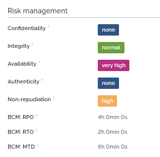

# iTop-br-riskassessment

A powerful iTop extension adding enhanced fields for documenting essential aspects of risk management and business continuity, including confidentiality, integrity, availability, authenticity, and non-repudiation, along with BCM details like RPO, RTO, and MTD.

---

## Overview

This extension introduces additional fields for comprehensive risk management documentation within iTop, specifically covering:

- **Confidentiality**
- **Integrity**
- **Availability**
- **Authenticity**
- **Non-repudiation**
- **BCM (Business Continuity Management)**:
  - RPO (Recovery Point Objective)
  - RTO (Recovery Time Objective)
  - MTD (Maximum Tolerable Downtime)

## Field Descriptions

### Confidentiality

Defines the level of confidentiality requirements:

- **None**
- **Normal**
- **High**
- **Very High**

### Integrity

Defines the level of data integrity requirements:

- **None**
- **Normal**
- **High**
- **Very High**

### Availability

Defines the level of system availability requirements:

- **None**
- **Normal**
- **High**
- **Very High**

### Authenticity

Defines whether authenticity checks are required:

- **None**
- **High**

### Non-repudiation

Defines whether non-repudiation checks are required:

- **None**
- **High**

### Business Continuity Management (BCM)

Key BCM metrics to aid in recovery planning:

- **RPO**: Recovery Point Objective – the maximum acceptable data loss in case of an incident.
- **RTO**: Recovery Time Objective – the target time for restoring operations after an incident.
- **MTD**: Maximum Tolerable Downtime – the maximum time the organization can sustain without critical functions.

## Compatibility

### iTop Version Compatibility

The extension is compatible with the following versions of iTop:

- **iTop 2.7 and 3.1**: [2.7 branch](https://github.com/rudnerbjoern/iTop-br-riskassessment/tree/itop/2.7)
- **iTop 3.1 and above**: [Main branch](https://github.com/rudnerbjoern/iTop-br-riskassessment/tree/main)

This extension has been successfully tested on iTop versions:

- 2.7.10
- 3.1.1
- 3.2.0-2

## License & Attribution

This project is licensed under the GPL-3.0 License © 2021-2024 Björn Rudner.

For details, refer to the [LICENSE](https://github.com/rudnerbjoern/iTop-br-riskassessment/blob/main/LICENSE) file.

---

With this iTop extension, enhance your organization’s approach to risk management by ensuring all critical risk and BCM metrics are documented effectively and centrally.
